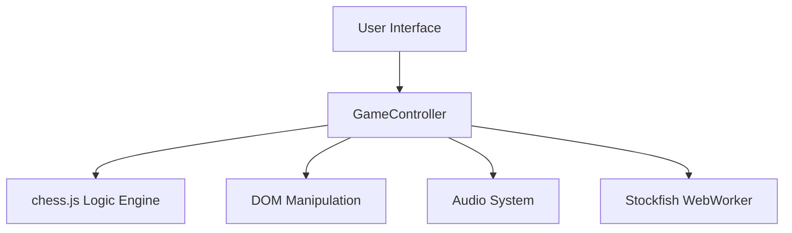

# Cosmic Chess: Architecture

## System Overview
Cosmic Chess is a client-side web application. All game logic runs in the browser, ensuring zero latency during gameplay.

## Component Architecture

## Technology Stack
- **Frontend Core**: HTML5, CSS3 (Glassmorphism UI).
- **Application Logic**: Vanilla JavaScript (ES6+).
- **Chess Engine**: `chess.js` (Handles move generation, validation, check/mate detection).
- **AI Engine (Future)**: Stockfish.js running in a Web Worker to prevent UI blocking.
